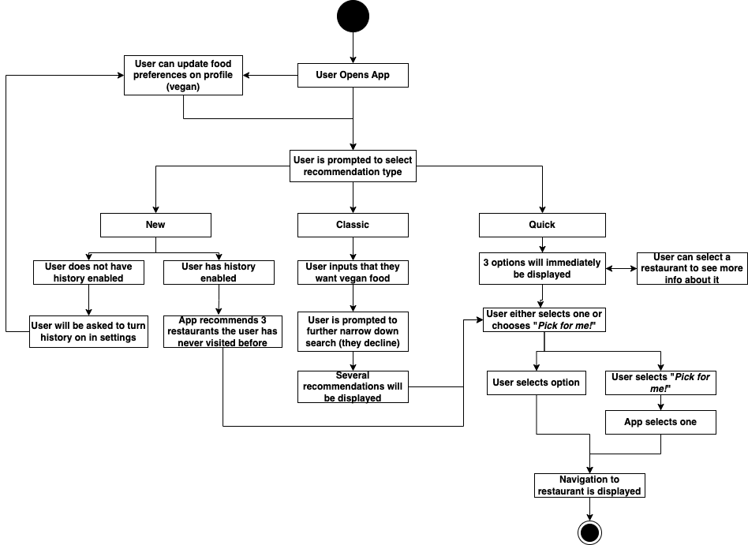

# Specification Phase Exercise

A little exercise to get started with the specification phase of the software development lifecycle. See the [instructions](instructions.md) for more detail.

## Team members

- Maya Humston [@mayhumst](https://github.com/mayhumst)
- Kurt Luko [@kl3641](https://github.com/kl3641)
- Ray Ochotta [@SnowyOchole](https://github.com/SnowyOchole)
- Brian Zou [@brianzou03](https://github.com/brianzou03)

## Stakeholders

A stakeholder interview was conducted on 2/2/2025 with *Jeremiah*, a prospective user of this app. The results of this interview are summarized below. 

- Goals / Needs

    - I would like to provide very little input
    - I would like the app to pick for me (i don't like making decisions)
    - I want it based on my location
    - I can share location and menu with friends

- Frustrations

    - I don't like being on my phone when i'm with friends (should be very fast!)
    - I don't like apps that drain my battery
    - I don't like apps that everyone has to have downloaded
    - I don't like being in restaurants with too many loud people

A stakeholder interview was conducted on 2/2/2025 with *Matilda*, a prospective user of this app. The results of this interview are summarized below. 

- Goals / Needs

    - Peanut-free restaurants (dietary restriction)
    - Busy schedule - cannot spend too long at restaurants
    - Need flexible restaurant locations
    - Need location tracking

- Frustrations

    - I don't like spending too much time on google maps
    - I am an indecisive restaurant picker
    - Most apps do not track dietary restrictions
    - Most apps do not account for how busy restaurants are

## Product Vision Statement

**Our application is a restaurant recommender that provides restaurant recommendations based on your location, preferences, and past history.**

## User Requirements

1. As a picky eater, I want an app that finds places so that can suit my needs.
2. As a stay at home mom, I want easy access to food so that I can stay at home.
3. As a vegan, I want to be easily be able to find restaurants that fit my dietary needs so that I don't need to scour google maps.
4. As a person in a hurry, I want Foodster to pick a good restaurant for me based off my previous tastes right now! 
5. As a busy businessman, I want convenient restaurants near my office so that I can keep working.
6. As a professional cyclist, I want to be able to find restaurants in remote places so that I can bike to remote areas and have access to food.
7. As someone who struggles with decision paralysis, I want to be able to decide what restaurant to go to with my friends every weekend.
8. As someone with dietary restrictions, I want access to restaurants that offer gluten-free meals so that I won't have to worry about my restrictions.
9. As an extreme antiscoial NEET, I want an app that finds restaurnats with the least amount of traffic as possible so I can avoid human interaction.
10. As a student with an open campus, I only have 45 minutes to find a decent spot to eat. I want an app that recommends me something decent quickly without much input on my end.

## Activity Diagrams

3. As a vegan, I want to be easily be able to find restaurants that fit my dietary needs so that I don't need to scour google maps.

## Clickable Prototype

Wireframe and prototype created in Figma. Click [here](https://www.figma.com/proto/1EwG4Ig1dRpKjIyfl5XBxY/The-Ballers?node-id=0-1&t=rqtzLwQ9ojsSWb36-1) to view. 
